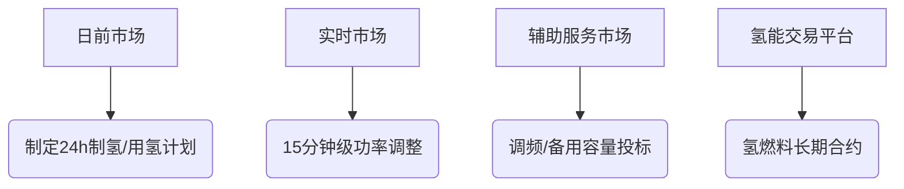

# Hydrogen_demand_response_market
---

# **氢能需求响应市场机制深度解析**  
## ——聚焦电力市场、氢能交易与政策激励的协同框架  

---

### **一、市场机制设计逻辑**  
#### 1. **氢能需求响应的双重属性**  
- **物理属性**：作为能源载体（存储/转换）  
- **商品属性**：作为交易标的（现货/期货）  
▶ **核心矛盾**：氢能系统的物理响应速度（小时级）与市场交易频率（分钟级）的时序错配  

#### 2. **市场分层架构**  


---

### **二、电力市场参与机制**  
#### 1. **现货市场套利策略**  
- **场景**：电解槽作为灵活负荷参与电价波动套利  
- **数学模型**：  
  ```math
  \max \sum_{t=1}^{24} [P_{sell}(t) \cdot π_{grid}(t) - P_{buy}(t) \cdot π_{grid}(t)]
  
  \text{s.t. } P_{buy}(t) = η_{elec} \cdot Q_{H2}(t)  
  ```  
  - π_grid(t)：分时电价  
  - η_elec：电解槽制氢效率（kWh/kg-H2）  

#### 2. **辅助服务市场**  
- **调频服务**：  
  - 燃料电池提供±2%额定功率/秒的调节能力  
  - 收益模式：容量费（$/MW） + 性能费（调节准确度奖励）  
- **备用容量**：  
  - 储氢系统承诺可调用容量（如保证1000kg氢随时可发电）  
  - 市场报价示例：$15/MW-day  

#### 3. **容量市场机制**  
- **容量信用机制**：  
  - 氢能系统提供的可靠容量可折算为传统发电机组当量  
  - 例：1MW燃料电池+72h储氢 ≈ 1.2MW燃气机组容量价值  
- **容量拍卖**：  
  - 提前3-5年锁定容量支付（保障氢能设备投资回收）  

---

### **三、氢能专属交易市场**  
#### 1. **氢能现货交易**  
| 交易类型 | 定价基准 | 典型场景 |  
|---------|----------|----------|  
| 管网输送 | 节点边际价格（类似天然气） | 输氢管道沿线交易 |  
| 罐车运输 | 到岸价（FOB） | 加氢站补给 |  
| 虚拟交易 | 电力市场联动价格 | 跨区域氢能金融对冲 |  

#### 2. **绿色氢能认证**  
- **证书机制**：  
  - 每生产1kg绿氢获得1个H2-GO（Green Hydrogen Origin）证书  
  - 证书价格：2023年欧盟均价 €2.5-3.5/kg-H2  
- **溯源技术**：  
  - 区块链存证：记录制氢所用可再生能源的发电时间/地点  

#### 3. **期货与金融工具**  
- **氢能期货合约**：  
  - 标准合约：1000kg/手，交割期3/6/12个月  
  - 价格发现功能：反映未来供需预期（如欧洲TTF天然气价格联动）  
- **套期保值策略**：  
  - 电解槽运营商同时做空电力期货+做多氢能期货，锁定电-氢价差  

---

### **四、政策激励机制**  
#### 1. **碳定价机制**  
- **碳税差异化**：  
  | 氢类型 | 碳排放（kgCO2/kg-H2） | 税收附加 |  
  |--------|-----------------------|-----------|  
  | 灰氢   | 10-12（天然气重整）   | $50/tonCO2 |  
  | 蓝氢   | 2-4（CCUS）          | $20/tonCO2 |  
  | 绿氢   | 0                     | 免税       |  

#### 2. **补贴与税收优惠**  
- **投资补贴**：  
  - 美国IRA法案：绿氢生产税收抵免最高$3/kg-H2  
- **运营补贴**：  
  - 中国示范项目：电解谷段用电价格0.3元/kWh（低于工商业电价50%）  

#### 3. **市场准入特权**  
- **优先调度权**：  
  - 绿氢生产负荷在可再生能源消纳困难时段优先接入电网  
- **输配电费减免**：  
  - 德国规定：电解槽接入电网仅支付实际用电量15%的输配电费  

---

### **五、典型商业模式**  
#### 1. **氢能聚合商（H2 Aggregator）**  
- **运作模式**：  
  ```mermaid
  graph LR
  A[分布式电解槽] --> B(聚合商虚拟电厂)
  C[储氢设施] --> B
  B --> D[参与电力市场投标]
  B --> E[提供氢能现货]
  ```  
- **收益来源**：  
  - 电力市场套利价差  
  - 氢能销售溢价（绿氢比灰氢贵€4-6/kg）  
  - 辅助服务补偿  

#### 2. **氢能共享经济**  
- **储氢设施共享**：  
  - 多个用户共用液氢储罐，按实际使用量付费（类似云存储）  
- **移动式加氢站**：  
  - 车载储氢单元根据需求动态部署（平抑区域氢价波动）  

#### 3. **电力-氢能联动合约**  
- **结构示例**：  
  - 电解槽运营商与风电场签订PPA（购电协议）：  
    - 固定电价：€0.04/kWh（当现货电价<€0.03时启动制氢）  
  - 同时与钢铁厂签订氢能供应协议：  
    - 浮动定价：Max(€5/kg, 1.2×现货氢价)  

---

### **六、优化决策模型框架**  
#### 1. **多市场联合优化模型**  
```python
# 伪代码示例
def market_optimization():
    # 输入参数
    electricity_price = get_day_ahead_prices()  # 日前电价预测
    hydrogen_demand = load_industrial_demand()  # 工业氢需求曲线
    
    # 决策变量
    P_grid = []  # 电网购电量
    Q_h2_produce = []  # 制氢量
    Q_h2_sell = []  # 售氢量
    
    # 目标函数：最大化总收益
    maximize(
        sum(hydrogen_sale_price[t] * Q_h2_sell[t] 
        - electricity_price[t] * P_grid[t] 
        + ancillary_service_income[t])
    )
    
    # 约束条件
    for t in time_steps:
        P_grid[t] == electrolyzer_efficiency * Q_h2_produce[t]  # 能量守恒
        Q_h2_sell[t] <= storage_inventory[t]  # 储氢量限制
        electrolyzer_min_load <= Q_h2_produce[t] <= electrolyzer_max_load  # 设备运行约束
```

#### 2. **风险控制策略**  
- **CVaR条件风险价值模型**：  
  ```math
  \max (1-\beta)E[Profit] + \beta \cdot CVaR_\alpha  
  ```  
  - β=0.7时表示70%权重关注最差10%情景下的收益保障  
- **实物期权应用**：  
  - 购买电解槽的柔性运营期权（支付溢价获得随时启停权利）  

---

### **七、国际实践案例**  
#### 1. **澳大利亚氢能交易中心（H2TCA）**  
- **机制创新**：  
  - 氢能期货价格与日本JKM LNG价格指数挂钩  
  - 允许用储氢容量作为期货交割保证金  
- **运行数据**：  
  - 2023年日均交易量达200吨，价格波动率比电力市场低40%  

#### 2. **加州氢能市场耦合实验**  
- **跨市场套利**：  
  - 当电力现货价格<$20/MWh且氢现货>$5/kg时自动启动电解槽  
- **成果**：  
  - 参与企业平均收益率提升23%，碳排放降低68%  

---

### **八、未来研究方向**  
1. **动态博弈模型**：  
   - 研究多氢能聚合商在寡头市场中的竞价策略  
2. **AI驱动定价**：  
   - 基于深度强化学习的实时市场报价算法  
3. **跨境氢能市场**：  
   - 欧洲-北非氢能管网的市场出清机制设计  

---

**学习建议**：  
- 使用MATLAB/Julia搭建简单市场仿真模型（推荐PowerModels.jl工具包）  
- 研究欧盟碳排放交易体系（ETS）第4阶段对氢能定价的影响  
- 关注美国PJM电力市场与氢能系统的耦合试点项目报告
